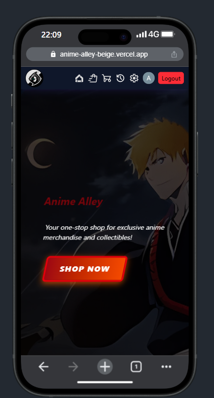
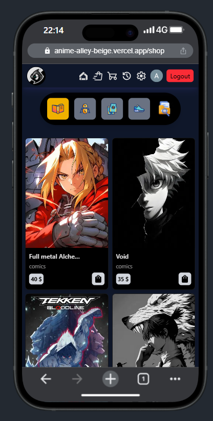
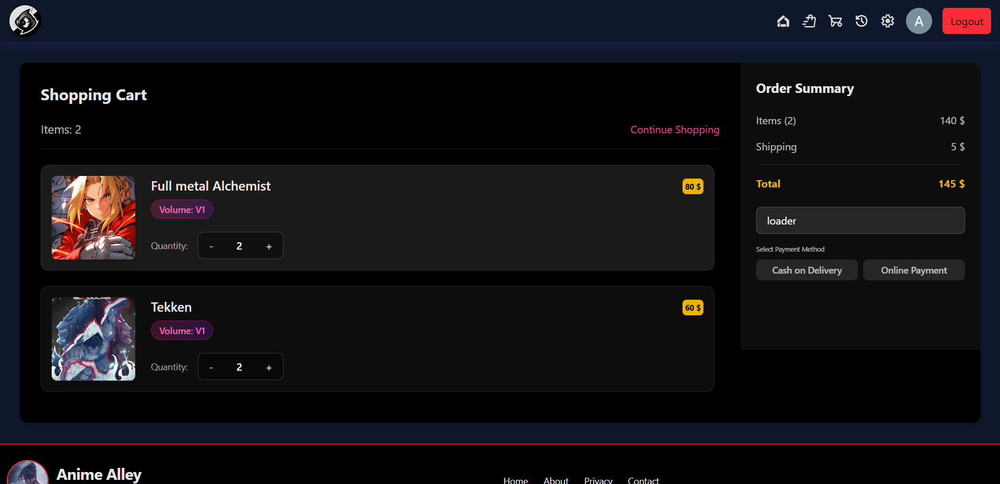
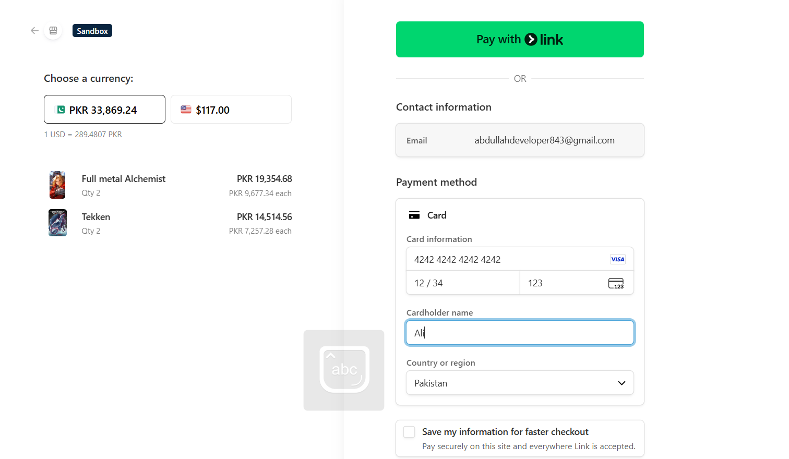
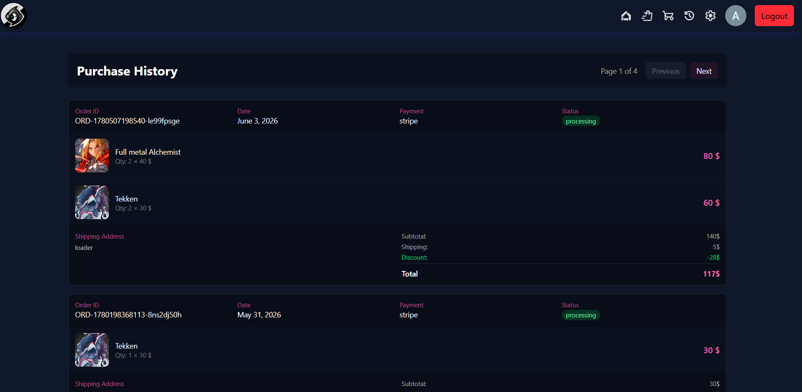
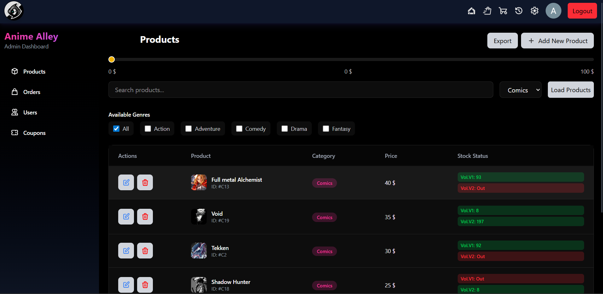
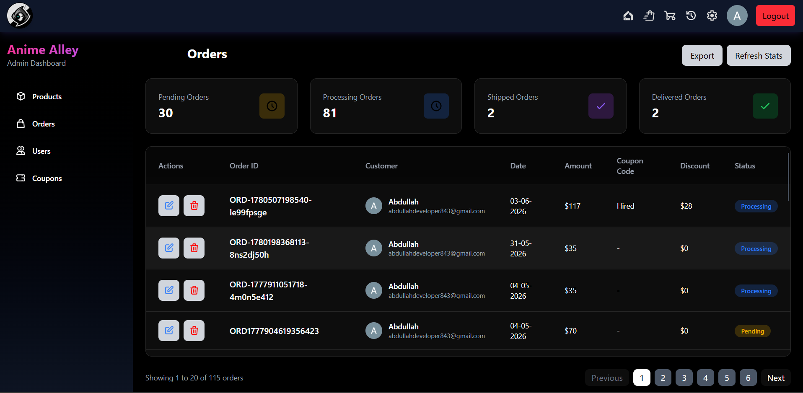
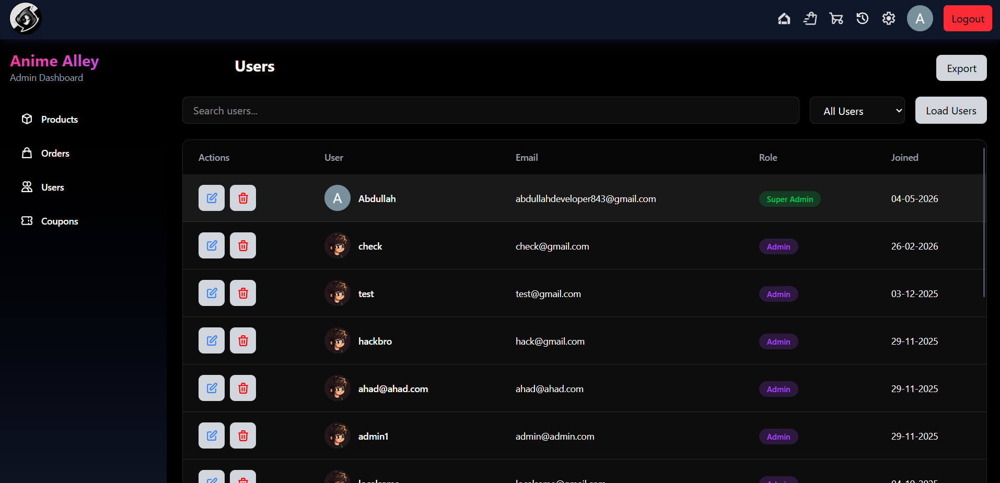
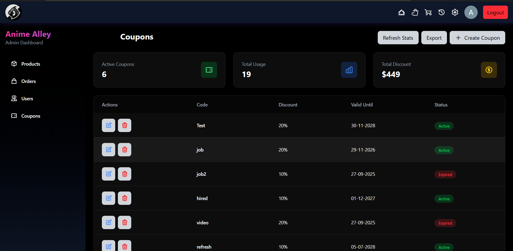

# Anime Alley

Anime Alley is a full-stack MERN e-commerce app for anime fans, with a customer storefront and an admin dashboard.

## Features

### Customer Experience

- Email/password sign-up with OTP verification and Google login
- Product browsing with search and category filtering
- Persistent cart and coupon support at checkout
- Cash on Delivery and Stripe payment options
- Order history and status tracking
- Responsive design for desktop and mobile

### Admin Tools

- Manage users, products, coupons, and orders
- Update order status from the dashboard
- Export data to Excel and PDF

## Screenshots

### Home Page

### Shop Page

### Cart Page

### Checkout / Payment

### Purchase History

### Admin Dashboard - Products

### Admin Dashboard - Orders

### Admin Dashboard - Users

### Admin Dashboard - Coupons

## Tech Stack:

- **Frontend:** React, Redux Toolkit, Tailwind CSS, React Hook Form, React Router DOM, Stripe.js, Google OAuth
- **Backend:** Node.js, Express.js, MongoDB Passport.js, Stripe SDK, Nodemailer, Cloudinary, ExcelJS, PDFKit
- **Deployment:** Vercel
